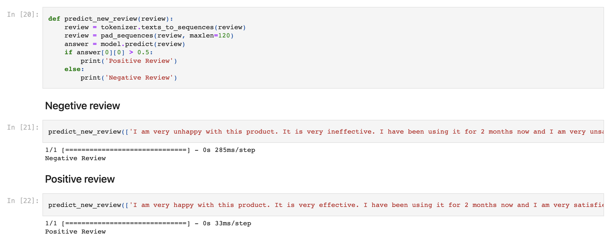
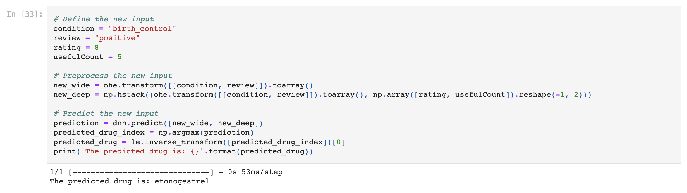
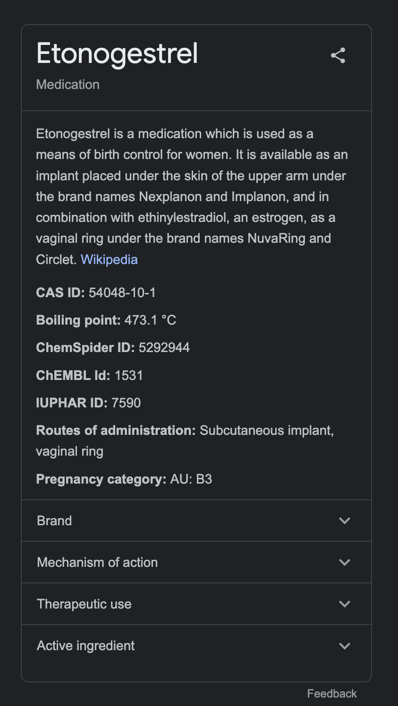

## Drug Prediction AI and Sentiment Analysis

This project involves building an AI system that performs sentimental analysis on drug reviews written by customers and predicts the appropriate drug to use based on the patient's conditions.

The sentimental analysis is done using LSTM (Long Short-Term Memory) to analyze the text data of drug reviews and extract the sentiment behind them. This process helps to identify the overall attitude of customers towards a particular drug and the common side effects experienced.

The AI system uses a W&DNN (Wide and Deep Neural Network) model to predict the best drug for a patient based on their conditions. The model is built on a cross-domain and cross-data learning approach, which allows it to learn from multiple datasets and adapt to different patient profiles.

The predictions from the W&DNN model are verified by analyzing the effectiveness of the recommended drug on patients with similar conditions.

  

The system has potential applications in the healthcare industry, where it can be used to personalize drug prescriptions based on individual patient conditions and sentiments.

This project was conducted by Surya Kallumadi from Kansas State University and Felix Gräßer from the Technical University of Dresden, and was published in the Proceedings of the 2018 International Conference on Digital Health.

## Citation
Felix Gräßer, Surya Kallumadi, Hagen Malberg, and Sebastian Zaunseder. 2018. Aspect-Based Sentiment Analysis of Drug Reviews Applying Cross-Domain and Cross-Data Learning. In Proceedings of the 2018 International Conference on Digital Health (DH '18). ACM, New York, NY, USA, 121-125. DOI:https://dl.acm.org/doi/10.1145/3194658.3194677
